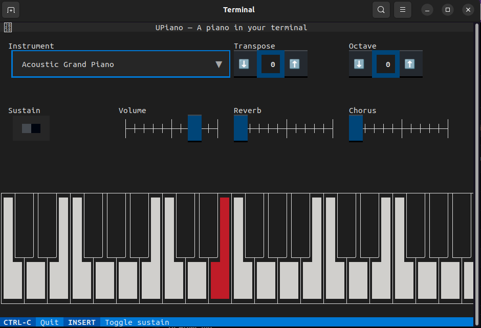

# UPiano

A Piano in your terminal.

## Screenshot

 

## How to run

First, you'll need to install [FluidSynth](https://www.fluidsynth.org/), if you haven't already. [See here how to install FluidSynth on your system](https://github.com/FluidSynth/fluidsynth/wiki/Download).

Then, install `upiano` via pip:

    pip install upiano

And then run:

    upiano

Make sure your terminal window is big enough.
The wider you can make it, the more keys you'll have! 🎹 😀

### How to play

To play with the mouse, click on the notes you want to play.

To play with the computer keyboard, there is a limited and currently hardcoded
keymap that corresponds to the following, which will play the notes on the left side:

    ┌─┬──┬┬──┬─┬─┬──┬┬──┬┬──┬─┬─┬──┬┬──┬─┬─┬──┬┐
    │ │██││██│ │ │██││██││██│ │ │██││██│ │ │██││
    │ │W█││E█│ │ │T█││Y█││U█│ │ │O█││P█│ │ │██││
    │ └┬─┘└┬─┘ │ └┬─┘└┬─┘└┬─┘ │ └┬─┘└┬─┘ │ └┬─┘│
    │A │ S │ D │F │ G │  H│ J │K │ L │ ; │' │  │
    └──┴───┴───┴──┴───┴───┴───┴──┴───┴───┴──┴──┘

Note that since the terminal doesn't really support key press and release events (it receives a stream of characters instead), there is no way to support two key playing at the same time with the computer keyboard only.

But you can play with the computer keyboard and with the mouse simultaneously, as you can see in this video: https://www.youtube.com/watch?v=0VXit110PcA

## Powered by

* [Python](https://www.python.org) 🐍
* [Textual](https://textual.textualize.io/)
* [FluidSynth](https://github.com/FluidSynth/fluidsynth)
* [pyFluidSynth](https://github.com/nwhitehead/pyfluidsynth)

Made with ❤️  by Elias Dorneles

## History

This started as a fun pairing project by friends
[Elias](https://github.com/eliasdorneles) and
[Nandaja](https://github.com/nandajavarma) around 2017, after they had
finished their [Recurse Center](https://recurse.com) retreat and were missing
hacking together.

They had fun building a small terminal piano app using
[urwid](https://urwid.org) for the user interface and playing notes by spawning
[sox](https://sox.sourceforge.net) subprocesses. This version is available in
the project source code, if you have urwid and sox installed, you can try it by
running: `python upiano/legacy.py`.

Fast-forward to 2023, Elias attended EuroPython and learned the
[Textual](https://textual.textualize.io) library there, got excited about
terminal apps again and decided to reboot this project using the newly acquired
knowledge, package and distribute it, and add to the fun by plugging a true
synthesizer to it, and playing with its controls.

### Changelog:

* **v0.1.2**
    * added volume, reverb and chorus sliders
    * fix packaging config, to work on any Python 3.10+
* **v0.1.1**
    * added sustain
    * fix mouse handling, and allow playing by "swiping" over keys
* **v0.1.0**
    * first version released to PyPI, already using Textual
